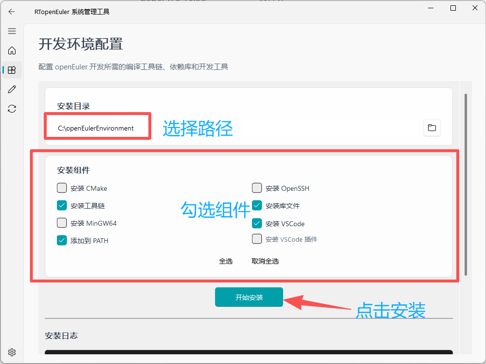
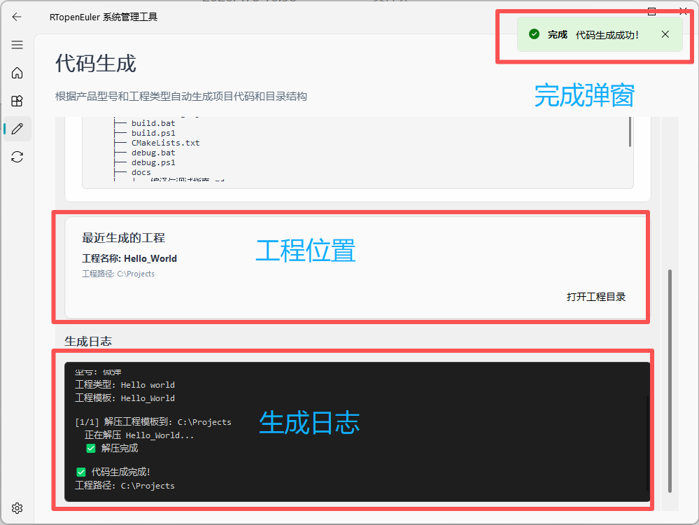
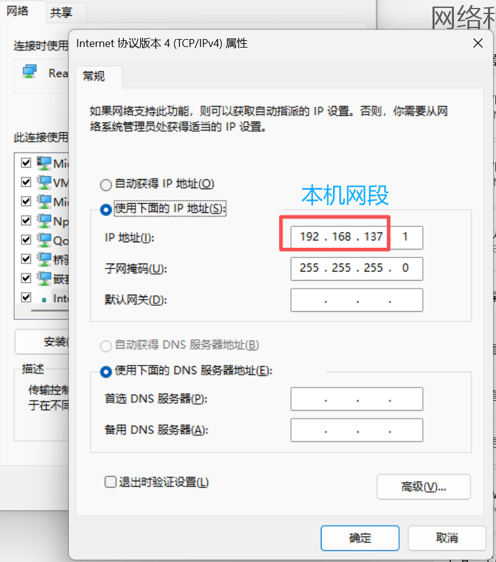

# RTopenEuler 系统管理工具 用户手册

---

## 版本信息

| 项目 | 内容 |
|------|------|
| 软件名称 | RTopenEuler 系统管理工具 |
| 版本号 | v0.0.1 抢先版 |
| 开发单位 | 803所 |
| 文档更新日期 | 2026年1月8日 |

---

## 目录

1. [软件概述](#软件概述)
2. [系统要求](#系统要求)
3. [安装与启动](#安装与启动)
4. [主界面介绍](#主界面介绍)
5. [开发环境配置](#开发环境配置)
6. [自动代码生成](#自动代码生成)
7. [设备初始化向导](#设备初始化向导)
8. [常见问题](#常见问题)
9. [附录](#附录)

---

## 软件概述

### 功能简介

RTopenEuler 系统管理工具是一个面向 openEuler 嵌入式开发环境的集成管理平台，主要提供以下功能：

* **开发环境配置**：一键部署编译器、依赖库、工具链，自动配置环境变量
* **自动代码生成**：根据产品型号和工程类型生成标准代码模板
* **设备初始化向导**：通过 SSH 远程完成 CCU 设备的出厂初始化配置
* **教程与文档**：提供完整的配置指南和代码示例

### 界面特色

软件采用 Material Design 设计语言，界面简洁现代，操作直观便捷：

* 浅灰底色 + 低饱和度蓝绿配色
* 卡片式布局，功能分区清晰
* 实时日志反馈，操作过程透明
* 多线程后台处理，界面响应流畅

---

## 系统要求

### 运行环境

| 环境项 | 最低要求 | 推荐配置 |
|--------|----------|----------|
| 操作系统 | Windows 7 及以上 | Windows 10/11 |
| 处理器 | 双核 1.5 GHz | 四核 2.0 GHz 及以上 |
| 内存 | 2 GB | 4 GB 及以上 |
| 硬盘空间 | 4 GB 可用空间 | 10 GB 及以上 |
| 网络环境 | 设备初始化功能需要 | 稳定的局域网连接 |

### 依赖组件

软件已集成所有必要组件，无需额外安装。运行时会自动处理：

* PyQt5 图形界面框架
* PyQt-Fluent-Widgets 组件库
* Paramiko SSH 客户端库

---

## 安装与启动

1. 双击 `openEulerManage.exe` 启动程序
2. 首次启动可能需要几秒钟加载界面

### 窗口说明

程序窗口初始大小为 1000×750 像素，包含以下区域：

* **顶部导航栏**：显示软件名称和 Logo
* **左侧边栏**：功能页面切换按钮
* **主内容区**：当前功能页面的操作界面
* **底部状态栏**：软件版本信息


---

## 主界面介绍

### 首页概览

启动程序后，首先进入首页界面。首页以卡片形式展示四大核心功能：

### 功能卡片说明

#### 1. 开发环境配置

* **功能描述**：一键部署编译器、依赖库、工具链，无需手动配置环境变量
* **操作按钮**：「立即配置」

#### 2. 自动代码生成

* **功能描述**：根据功能需求，生成初始化模板、驱动代码、示例工程
* **操作按钮**：「选择代码生成」

#### 3. 设备初始化向导

* **功能描述**：完成 CCU 基础参数配置、驱动环境加载
* **操作按钮**：「启动向导」

#### 4. 教程与文档

* **功能描述**：查看配置指南、代码示例、常见问题
* **操作按钮**：「浏览教程」

### 新手指引

首页底部提供新手指引区域，建议首次使用按以下顺序操作：

> **首次使用建议**：先配置开发环境 → 生成示例代码 → 查看教程验证

---

## 开发环境配置

### 功能概述

开发环境配置模块可以一键安装 openEuler 开发所需的所有工具链和依赖库，包括：

* CMake 构建工具
* ARM GNU 工具链
* 开发库文件
* MinGW64 编译器
* VSCode 编辑器
* VSCode 常用插件

### 进入配置页面

通过以下两种方式均可进入开发环境配置页面：

1. 在首页点击「开发环境配置」卡片的「立即配置」按钮
2. 点击左侧导航栏的「环境配置」图标


### 页面布局

环境配置页面分为三个区域：

1. **配置选项卡**：选择需要安装的组件
2. **目录设置**：设置源文件和目标安装目录
3. **日志显示区**：显示安装进度和详细信息

### 配置选项说明

#### 安装组件选择

页面提供以下可安装组件（以复选框形式呈现）：

| 组件名称 | 说明 | 安装方式 | 文件来源 |
|----------|------|----------|----------|
| CMake | 跨平台构建工具 | MSI 静默安装 | cmake.msi |
| OpenSSH | SSH 客户端工具 | MSI 静默安装 | openssh.msi |
| ARM GNU Toolchain | ARM 交叉编译工具链 | 解压缩 | toolchain |
| 库文件 | 开发依赖库 | 解压缩 | libs |
| MinGW64 | Windows 编译器 | 解压缩 | mingw64 |
| VSCode | 代码编辑器 | 解压缩 | vscode |
| VSCode 插件 | VSCode 扩展 | 解压缩 | extensions |
| 添加到 PATH | 修改环境变量 | 注册表操作 | - |

**注意**：如果某个组件的源文件不存在，对应的复选框将自动禁用。

#### 目录设置

* **源文件目录**：存放安装包的目录，程序会自动检测
* **目标安装目录**：工具链和库文件的安装位置，默认为 `C:\openEulerTools`

点击「浏览」按钮可以打开文件夹选择对话框更改目录。

### 安装操作步骤

#### 步骤一：选择组件

1. 勾选需要安装的组件
2. 确认源文件目录包含所有必需的安装包
3. 设置目标安装目录

**注意**：理论上讲所有项目都必须安装，除了你已经安装过的组件，否则无法正常调试或编译 CCU 上的项目。



#### 步骤二：开始安装

点击「开始安装」按钮后：

1. 程序会创建后台安装线程
2. 「开始安装」按钮变为「安装中...」并禁用
3. 日志区域开始显示安装进度

#### 步骤三：监控进度

安装过程中，日志区域会实时显示：

* 当前执行的步骤
* 文件解压进度
* 任何错误或警告信息
* 安装完成提示

#### 步骤四：完成安装

安装完成后会显示成功提示：

* 顶部弹出成功消息条
* 日志区显示「✅ 安装成功完成！」
* 「开始安装」按钮恢复为可点击状态

### 取消安装

如需中断安装过程：

1. 点击「取消安装」按钮
2. 当前步骤完成后会停止安装
3. 已安装的组件会保留

### 环境变量配置

如果勾选了「添加到 PATH」选项，程序会：

1. 自动读取当前系统的 PATH 环境变量
2. 将安装目录下的 bin 目录添加到 PATH
3. 通过修改 Windows 注册表实现永久生效

**注意**：修改环境变量后，开启的命令行窗口需要重启才能生效。

### 常见安装问题

#### 问题 1：组件复选框为灰色

**原因**：源文件目录中缺少对应的安装包文件

**解决方法**：
1. 检查源文件目录路径是否正确
2. 确认所需安装包文件已放置在源目录中
3. 文件名必须与程序要求的一致

#### 问题 2：安装过程中断

**原因**：磁盘空间不足或文件损坏

**解决方法**：
1. 检查目标磁盘可用空间（建议 10GB 以上）
2. 重新下载安装包文件
3. 以管理员权限运行程序

#### 问题 3：PATH 环境变量未生效

**原因**：系统环境变量缓存

**解决方法**：
1. 重启计算机
2. 或在命令行手动刷新：`refreshenv`

---

## 自动代码生成

### 功能概述

代码生成模块可以根据产品型号和工程类型，自动生成标准化的项目代码和目录结构。

支持的工程类型包括：

* **Hello World**：最简单的示例工程
* **MB_DDF**：MB_DDF 示例工程
* **Helm_Control**：舵机控制工程
* **Auto_Pilot**：自动驾驶仪工程（暂无内容）
* **Upgrade_And_Test**：监控和测试工程

### 进入代码生成页面

通过以下两种方式均可进入代码生成页面：

1. 在首页点击「自动代码生成」卡片的「选择代码生成」按钮
2. 点击左侧导航栏的「代码生成」图标


### 页面布局

代码生成页面分为四个区域：

1. **工程配置卡**：设置产品型号、工程类型和输出目录
2. **目录结构预览**：显示即将生成的项目目录结构
3. **最近生成的工程**：显示最近一次生成的工程信息
4. **生成日志**：显示生成过程的详细信息

### 生成操作步骤

#### 步骤一：配置工程参数

1. **选择产品型号**：从下拉框选择（目前支持「微弹」）
2. **选择工程类型**：从下拉框选择所需的工程模板
3. **设置输出目录**：点击「浏览」按钮选择或输入目录路径

#### 步骤二：预览目录结构

选择工程类型后，目录结构预览区会自动显示该工程的文件结构：

```
Hello_World/
├── src/
│   ├── main.cpp
├── CMakeLists.txt
...
```

#### 步骤三：开始生成

点击「生成代码」按钮后：

1. 程序验证配置参数
2. 解压工程模板到输出目录
3. 完成后显示成功提示



#### 步骤四：查看结果

生成完成后：

1. 日志区显示「✅ 代码生成完成！」
2. 「最近生成的工程」卡片显示工程信息
3. 点击「打开工程目录」按钮可直接打开项目文件夹

### 工程模板说明

#### Hello World

最简单的入门示例，包含基本的程序结构和编译配置。

* **适用场景**：初次使用、验证开发环境

#### MB_DDF

MB_DDF 协议相关的示例工程。

* **适用场景**：MB_DDF 协议开发
* **包含内容**：协议实现、示例代码

#### Helm_Control

舵机控制功能的完整实现。

* **适用场景**：舵机控制系统开发
* **包含内容**：控制算法、驱动接口

#### Auto_Pilot

自动驾驶仪功能的参考实现。

* **适用场景**：自动驾驶系统开发
* **包含内容**：控制逻辑

#### Upgrade_And_Test

系统升级和测试工具集。

* **适用场景**：设备升级、功能测试
* **包含内容**：升级、测试用例

### 常见生成问题

#### 问题 1：找不到工程模板

**原因**：程序目录下缺少 `programs` 文件夹或模板文件

**解决方法**：
1. 检查程序目录下是否有 `programs` 文件夹
2. 确认所需的工程模板文件存在
3. 重新安装或修复程序文件

#### 问题 2：生成后文件名乱码

**原因**：文件编码问题

**解决方法**：
1. 程序已自动处理常见编码问题
2. 如仍有问题，请使用支持 UTF-8 的压缩工具重新打包模板

#### 问题 3：输出目录权限错误

**原因**：目标目录没有写入权限

**解决方法**：
1. 选择其他输出目录
2. 以管理员权限运行程序
3. 检查磁盘空间是否充足

---

## 设备初始化向导

### 功能概述

设备初始化向导用于通过 SSH 远程执行 CCU 设备的出厂初始化操作，包括：

* 设置 root 密码
* 创建文件系统目录结构
* 上传配置文件和程序
* 配置动态库搜索路径
* 执行硬盘扩容
* 运行安全测试
* 配置系统时间
* 重启设备

### 网络要求

使用设备初始化功能需要：

1. CCU 设备已通过网线连接到计算机
2. 计算机和设备在同一局域网内
3. 设备默认 IP 地址：`192.168.137.100`
4. 设备 SSH 服务已启动



### 进入初始化页面

通过以下两种方式均可进入设备初始化页面：

1. 在首页点击「设备初始化向导」卡片的「启动向导」按钮
2. 点击左侧导航栏的「系统初始化」图标


### 页面布局

设备初始化页面分为四个区域：

1. **操作控制区**：包含「一键初始化」按钮和选项设置
2. **路径设置区**：显示和选择项目文件路径
3. **状态显示区**：显示当前操作状态
4. **日志显示区**：显示详细的操作日志

### 初始化操作步骤

一键初始化会自动完成以下所有步骤：

1. 自动定位项目文件路径
2. 上传文件到设备（可选）
3. 执行完整的初始化命令序列

**操作步骤**：

1. 勾选「上传文件」复选框（如需上传文件，一般情况下建议勾选）
2. 点击「一键初始化」按钮
3. 等待完成，设备将自动重启

点击「开始初始化」按钮后，程序会按顺序执行以下命令：

| 步骤 | 操作 | 说明 |
|------|------|------|
| 1 | 设置 root 密码 | 配置设备登录密码 |
| 2 | 创建文件夹结构 | 在 `/home/sast8/` 下创建目录 |
| 3 | 配置动态库路径 | 设置 `/etc/ld.so.conf.d/sast8_libs.conf` |
| 4 | 硬盘扩容 | 执行 `resize2fs-arm64` 扩容文件系统 |
| 5 | 执行安全测试 | 运行 `test_secure` 程序 |
| 6 | 清理测试文件 | 删除临时测试文件 |
| 7 | 清理系统文件 | 删除不需要的配置文件 |
| 8 | 配置系统时间 | 同步系统时间 |
| 9 | 重启系统 | 执行 `reboot` 命令 |

### SSH 连接配置

默认连接参数（硬编码在程序中）：

| 参数 | 值 |
|------|-----|
| 主机地址 | 192.168.137.100 |
| 用户名 | root |
| 密码 | Shanghaith8 |
| 连接超时 | 30 秒 |

### 日志说明

初始化过程中，日志区域会显示：

* **连接信息**：SSH 连接状态
* **命令执行**：每个步骤的命令和输出
* **进度信息**：当前步骤编号和总数
* **错误信息**：任何错误或警告

日志示例：
```
开始连接SSH...
SSH连接成功
[1/9] 创建文件夹结构
[2/9] 配置动态库路径
...
✓ 初始化完成！
```

### 完成提示

初始化成功后会显示：

* 顶部绿色成功提示：「系统出厂初始化已完成，设备即将重启！」
* 状态标签显示：「初始化完成」
* 日志区显示完成信息

### 常见初始化问题

#### 问题 1：SSH 连接失败

**可能原因**：
1. 网络连接不通
2. 设备 IP 地址不正确
3. 设备 SSH 服务未启动

**解决方法**：
1. 使用 ping 命令测试网络：`ping 192.168.137.100`
2. 检查网线连接
3. 确认设备已开机
4. 重启设备

#### 问题 2：密码认证失败

**可能原因**：
1. 设备密码已修改
2. 配置文件中的密码不正确

**解决方法**：
1. 联系设备管理员确认密码

#### 问题 3：文件上传失败

**可能原因**：
1. 本地文件路径不正确
2. 设备磁盘空间不足
3. 网络传输中断

**解决方法**：
1. 检查本地项目路径是否正确
2. 清理设备磁盘空间
3. 重新执行上传操作

#### 问题 4：命令执行错误

**可能原因**：
1. 命令在设备上不存在
2. 权限不足
3. 文件系统错误

**解决方法**：
1. 查看日志中的详细错误信息
2. 手动 SSH 登录设备执行命令测试
3. 检查设备系统状态

---

## 常见问题

### 安装和启动

**Q: 双击 exe 文件没有反应？**

A: 请检查：
1. 是否被杀毒软件拦截
2. 以管理员权限运行
3. 检查 Windows 版本是否为 Windows 7 及以上

---

### 功能使用

**Q: 开发环境配置很慢怎么办？**

A: 安装速度取决于：
1. 硬盘读写速度
2. 文件大小
3. 系统性能

建议耐心等待，不要中断安装过程。

---

**Q: 代码生成后如何编译？**

A: 每个工程模板都包含 `CMakeLists.txt` 文件：
1. 打开命令行，进入工程目录
2. 查看 docs 目录下的说明文档

---

## 附录

### A. 文件目录结构

完整的程序目录结构如下：

```
openEulerEnvironment/
├── src/                              # 源代码
│   ├── main_window.py               # 主窗口
│   ├── home_interface.py            # 首页界面
│   ├── settings_interface.py        # 设置界面
│   ├── initializer_interface.py     # 系统初始化界面
│   ├── environment_install_interface.py  # 环境配置界面
│   └── code_generation_interface.py     # 代码生成界面
├── docs/                            # 文档
│   ├── environment_guide.md         # 环境操作指南
│   └── 本程序怎么使用.md              # 本文档
├── programs/                        # 代码生成模板
│   ├── Hello_World/
│   ├── MB_DDF/
│   ├── Helm_Control/
│   ├── Auto_Pilot/
│   └── Upgrade_And_Test/
├── main_window.exe                  # 可执行文件
└── .gitignore                       # Git 忽略文件
```

### B. 快捷键说明

| 快捷键 | 功能 |
|--------|------|
| Ctrl + C | 复制选中内容 |
| Ctrl + V | 粘贴内容 |
| Ctrl + A | 全选 |
| 鼠标滚轮 | 滚动页面 |

### C. 技术支持

如遇到问题或需要帮助，请联系：

* **技术支持**：请联系 803 所技术支持团队
* **问题反馈**：请提供详细的错误信息和操作步骤
* **功能建议**：欢迎提出改进建议

### D. 版本历史

| 版本 | 日期 | 更新内容 |
|------|------|----------|
| v0.0.1 | 2026-01-08 | 抢先版发布，包含四大核心功能 |

---

**文档结束**

© 2026 803所 版权所有
