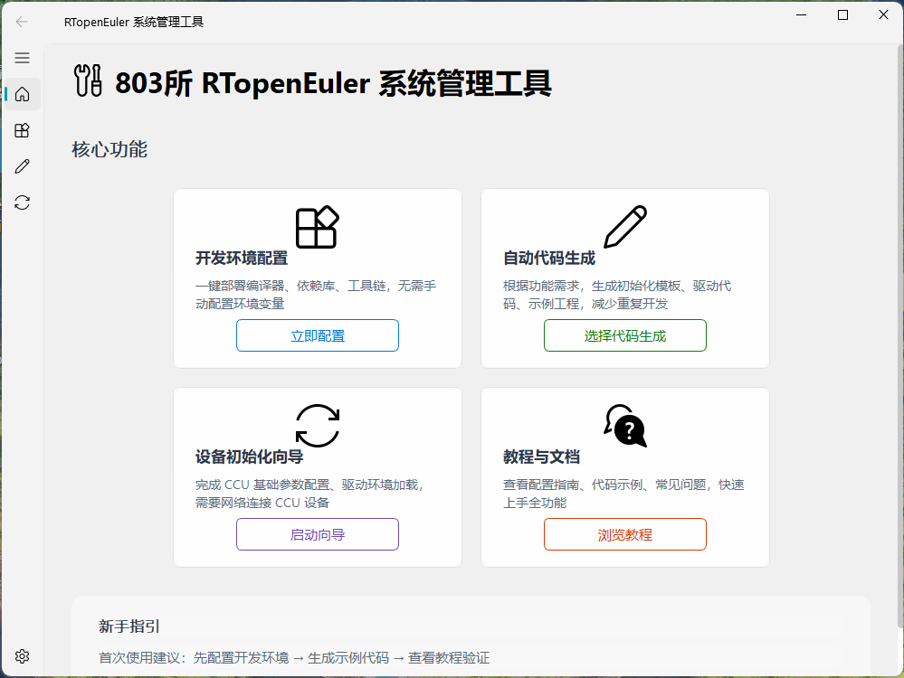
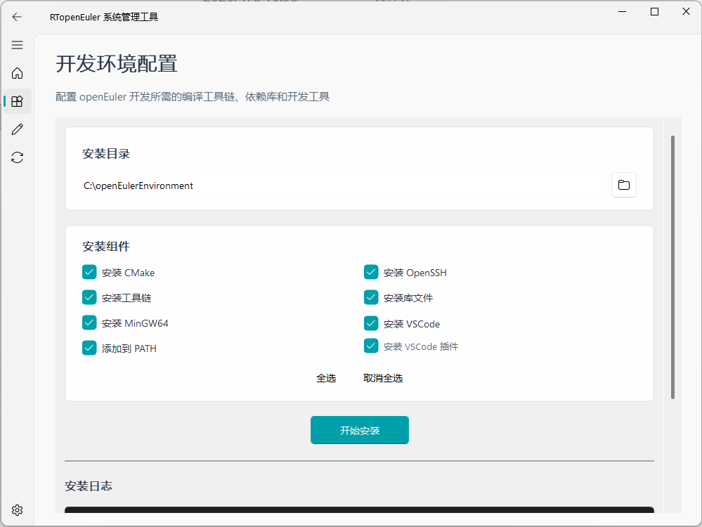
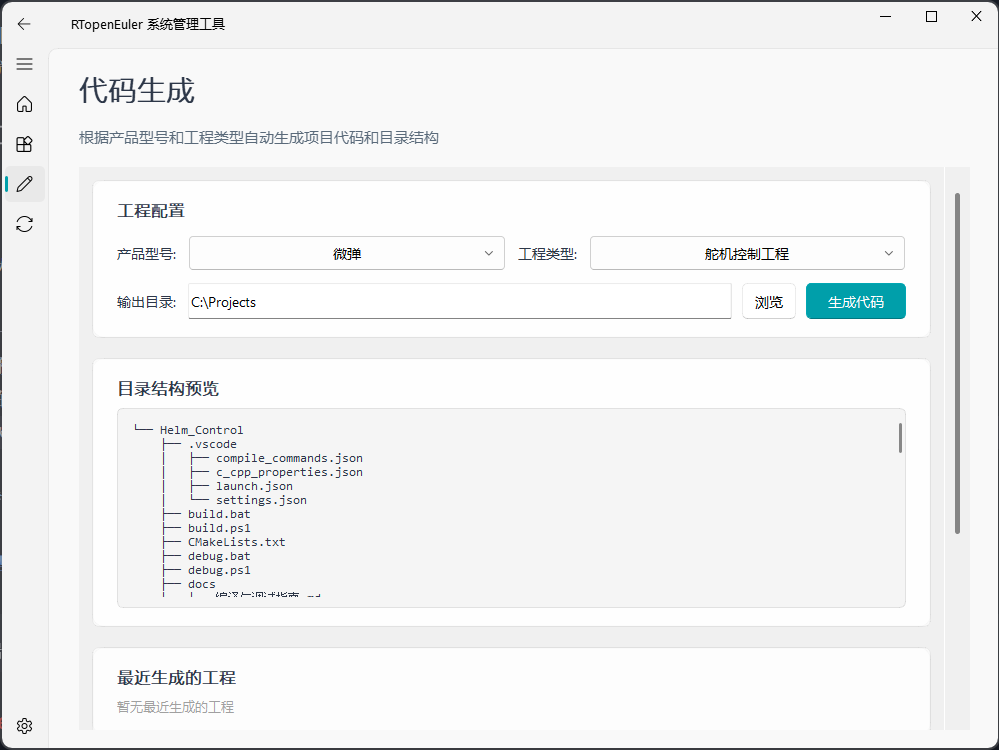
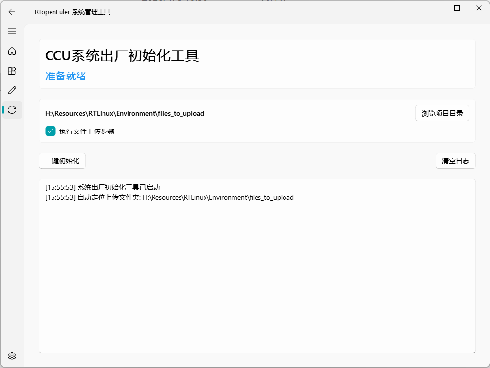

# RTopenEuler 系统管理工具 用户手册

---

## 版本信息

| 项目 | 内容 |
|------|------|
| 软件名称 | RTopenEuler 系统管理工具 |
| 版本号 | v1.0.1 |
| 文档更新日期 | 2026年4月19日 |

---

## 目录

1. [软件概述](#软件概述)
2. [系统要求](#系统要求)
3. [安装与启动](#安装与启动)
4. [登录与注册](#登录与注册)
5. [主界面介绍](#主界面介绍)
6. [开发环境配置](#开发环境配置)
7. [自动代码生成](#自动代码生成)
8. [设备初始化向导](#设备初始化向导)
9. [远程终端](#远程终端)
10. [FTP 客户端](#ftp-客户端)
11. [数据可视化](#数据可视化)
12. [设置与教程](#设置与教程)
13. [常见问题](#常见问题)
14. [附录](#附录)

---

## 软件概述

### 功能简介

RTopenEuler 系统管理工具是一个面向 openEuler 嵌入式开发环境的集成管理平台，主要提供以下功能：

* **开发环境配置**：一键部署编译器、依赖库、工具链，自动配置环境变量
* **自动代码生成**：根据产品型号和工程类型生成标准代码模板
* **设备初始化向导**：通过 SSH 远程完成 CCU 设备的出厂初始化配置
* **远程终端**：SSH 交互式终端
* **FTP 客户端**：本地与远端文件上传、下载、移动
* **数据可视化**：读取 SLOG 文件并绘制曲线
* **教程与文档**：配置指南、代码示例、版本说明

### 界面特色

软件采用 Fluent 设计语言，界面简洁现代，操作直观便捷：

* 卡片式布局，功能分区清晰
* 多线程后台处理，界面响应流畅
* 日志与状态提示及时反馈

---

## 系统要求

### 运行环境

| 环境项 | 最低要求 | 推荐配置 |
|--------|----------|----------|
| 操作系统 | Windows 7 及以上 | Windows 10/11 |
| 处理器 | 双核 1.5 GHz | 四核 2.0 GHz 及以上 |
| 内存 | 2 GB | 4 GB 及以上 |
| 硬盘空间 | 4 GB 可用空间 | 10 GB 及以上 |
| 网络环境 | 设备初始化/FTP/终端功能需要 | 稳定的局域网连接 |

---

## 安装与启动

1. 双击 `openEulerManage.exe` 启动程序
2. 首次启动可能需要几秒钟加载界面

### 窗口说明

主窗口初始大小为 1700×1050 像素，包含以下区域：

* **标题栏**：显示软件名称和图标
* **左侧导航栏**：功能页面切换按钮
* **主内容区**：当前功能页面的操作界面



---

## 登录与注册

程序启动后会先进入登录界面：

1. **已有账号**：输入用户名和密码登录
2. **首次使用**：点击“注册”，输入用户名、密码和 16 位邀请码

**说明**：
- 邀请码由管理员提供
- 登录成功后会显示初始化进度条并进入主窗口

---

## 主界面介绍

### 首页概览

首页以卡片形式展示核心功能入口（4 列 2 行布局）：

1. **开发环境配置**
2. **自动代码生成**
3. **远程终端**
4. **FTP 客户端**
5. **数据可视化**
6. **设备初始化向导**
7. **教程与文档**

### 新手指引

建议首次使用按以下顺序操作：

> 先阅读教程 → 配置开发环境 → 生成示例代码 → 进入设备初始化

---

## 开发环境配置

### 功能概述

一键安装 openEuler 开发所需的工具链和依赖库，包括：

* CMake 构建工具
* ARM GNU 工具链
* 开发库文件
* MinGW64 编译器
* VSCode 编辑器及插件

### 进入配置页面

1. 首页点击「开发环境配置」卡片
2. 左侧导航栏点击「环境配置」



### 使用步骤

1. 勾选需要安装的组件
2. 设置源文件目录与目标安装目录
3. 点击「开始安装」
4. 通过日志区查看进度与结果

**注意**：源文件缺失时，对应组件会被置灰。

---

## 自动代码生成

### 功能概述

根据产品型号与工程类型生成标准工程模板。

支持的工程类型：

* Hello_World
* MB_DDF
* Helm_Control
* Auto_Pilot
* Upgrade_And_Test
* No8RtBus

### 使用步骤

1. 选择产品型号与工程类型
2. 设置输出目录
3. 点击「生成代码」
4. 日志区提示完成，并可打开工程目录



---

## 设备初始化向导

### 功能概述

通过 SSH 远程完成 CCU 设备出厂初始化，包括：

* 设置 root 密码
* 创建目录结构
* 上传必要文件
* 配置动态库路径
* 硬盘扩容
* 运行安全测试
* 配置系统时间并重启

### 网络要求

* 设备与电脑在同一局域网
* 设备 SSH 服务已启动
* 默认 IP 为 `192.168.137.100`



### 使用步骤

1. 确认 SSH 参数正确
2. 勾选“上传文件”（如需）
3. 点击「一键初始化」
4. 等待完成并观察日志

---

## 远程终端

### 功能概述

提供 SSH 交互式终端，支持命令输入、输出显示、复制粘贴。

### 使用步骤

1. 在终端页面填写或确认 SSH 连接信息
2. 点击连接
3. 在终端区域输入命令并查看结果

---

## FTP 客户端

### 功能概述

通过 SFTP 连接远端设备，进行文件上传、下载和移动。

### 使用步骤

1. 填写主机地址、用户名、密码
2. 点击「连接 FTP」
3. 选择本地/远端文件后点击上传或下载
4. 可进行新建文件夹、重命名、删除等操作

**提示**：连接成功后状态显示为“FTP 已连接”。

---

## 数据可视化

### 功能概述

读取 `.slog` 文件并绘制曲线，可选择要显示的字段。

### 本地文件

1. 点击「浏览文件」
2. 选择本地 `.slog` 文件
3. 在左侧勾选字段并查看图表

### 远程文件

1. 先在 FTP 客户端完成连接
2. 点击「选择远程文件」
3. 在弹窗中搜索/过滤并选择 `.slog` 文件
4. 程序会下载到临时目录并自动解析

**说明**：
- 远程文件会下载到临时目录，完成后自动清理
- 弹窗会记住上一次选择的远端目录

---

## 设置与教程

### 设置页面

设置页面提供以下内容：

* 字体大小（小/中/大）
* 默认输出目录与安装目录
* SSH 默认连接信息
* 自动检查更新、日志时间戳、初始化确认开关

**使用步骤**：
1. 通过左侧导航栏进入「设置」
2. 调整字体大小与目录参数
3. 修改 SSH 主机、用户名、密码（影响初始化/终端/FTP 默认值）
4. 根据需要打开/关闭开关项
5. 点击「保存设置」

**注意**：
- 字体大小需要重启应用生效
- 保存后会写入 `settings.json`

### 教程与文档

教程页面用于查看：

* 使用手册与配置指南
* 版本说明（`docs/versions/` 下的 `.txt` 文件）

**使用步骤**：
1. 进入左侧导航栏的「教程文档」
2. 点击对应条目打开文档或版本说明
3. 若文档为空，请确认 `docs/` 与 `docs/versions/` 目录存在

---

## 常见问题

### Q1: 远程文件按钮不可用？

**原因**：FTP 未连接。  
**解决**：先在 FTP 页面完成连接。

### Q2: 登录失败或注册失败？

**原因**：用户名/密码为空或邀请码错误。  
**解决**：确认邀请码为 16 位且由管理员提供。

### Q3: 数据可视化无法读取文件？

**原因**：文件不是 `.slog` 或文件损坏。  
**解决**：请确认文件格式正确。

---

## 附录

### A. 程序目录结构（摘要）

```
openEulerEnvironment/
├── src/
│   ├── core/                       # 认证/配置/字体/SLOG解析
│   ├── ui/
│   │   ├── interfaces/             # 各功能界面
│   │   ├── loading_dialog.py       # 加载提示
│   │   └── main_window.py          # 主窗口
│   └── main.py
├── docs/
│   ├── images/                     # 文档截图
│   └── versions/                   # 版本说明
└── requirements.txt
```

### B. 版本历史

| 版本 | 日期 | 更新内容 |
|------|------|----------|
| v1.0.1 | 2026-04-19 | 发布 1.0 补丁版本，修正公共 GitHub Actions CI 基线，将 Qt 界面测试移出非 GUI 发布验证范围 |
| v1.0 | 2026-04-19 | 发布首个公开 GitHub 版本，统一公开仓库元数据与应用版本标识，整理 PyInstaller 打包与公共文档说明 |
| v0.0.8 | 2026-04-08 | 新增 cx_Freeze 打包支持，补充 RESERVED 字段类型支持，完善算法编辑与协议导出能力 |

---

文档结束
