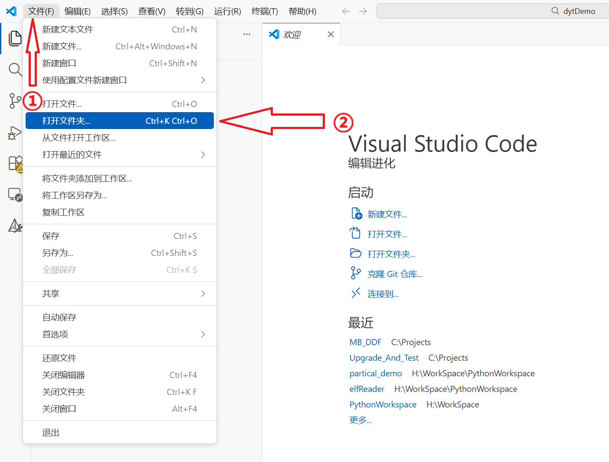
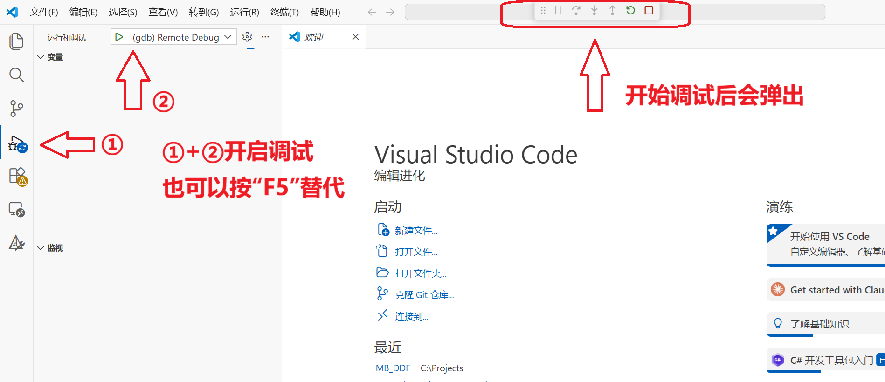

# 示例工程使用方法

本文档以 **MB_DDF示例工程** 为例，旨在引导用户如何快速上手示例工程，涵盖了从环境打开到编译、部署及调试的全过程。

---

## 1. 环境准备与打开工程

### 1.1 打开 VS Code
1.  启动 **Visual Studio Code**。
2.  点击左上角的 **文件 (File)** -> **打开文件夹... (Open Folder...)**。
3.  选择本示例工程的根目录（即包含 `build.bat` 和 `debug.bat` 的文件夹）。



### 1.2 打开集成终端
在 VS Code 中，使用快捷键 `Ctrl + ` `（键盘 1 左侧的按键）打开集成终端。确保终端类型为 **PowerShell**。

---

## 2. 编译项目 (build.bat)

`build.bat` 是一个封装了 PowerShell 脚本的批处理文件，用于在 Windows 上进行交叉编译。

### 2.1 基础用法

在终端中运行以下命令：

*   **编译调试版本**：
    ```bash
    .\build.bat debug
    ```
*   **编译发行版本**：
    ```bash
    .\build.bat release
    ```
*   **清理工程**：
    ```bash
    .\build.bat clean
    ```

### 2.2 更改默认工程名

脚本默认的工程名称为 `DemoProject`。如果需要更改编译出的可执行文件名：

1.  打开项目根目录下的 `build.bat`。
2.  找到 `set "PROJECT_NAME_OVERRIDE=DemoProject"`。
3.  将 `DemoProject` 更改为您想要的名称。
4.  保存并重新编译。

### 2.3 脚本参数说明

`build.bat` 支持透传参数给底层的编译引擎：

| 参数 | 说明 | 默认值 |
| :--- | :--- | :--- |
| `-ProjectName` | 指定生成的可执行文件名 | `DemoProject` |
| `-Jobs` | 指定并行编译的线程数 | `8` |
| `-Sysroot` | 指定 aarch64 的 sysroot 路径 | 自动从工具链识别 |
| `-ToolchainBin`| 指定交叉编译工具链的 `bin` 目录 | 自动识别 |

**示例**：指定 4 线程编译并命名为 `TestApp`
```bash
.\build.bat debug -ProjectName TestApp -Jobs 4
```

---

## 3. 调试与运行 (debug.bat)

`debug.bat` 用于将编译好的文件同步到目标板，并启动调试环境。

### 3.1 基础调试用法

确保目标板已联网且与开发机互通，然后运行：
```bash
.\debug.bat
```

运行后，脚本会：
1.  自动更新 `.vscode/launch.json` 中的 GDB 路径和 sysroot。
2.  通过 SSH 连接目标板并同步可执行文件。
3.  在目标板上启动 `gdbserver`。

此时，在 VS Code 中按下 **F5** 即可开始调试。



### 3.2 直接运行 (Release模式)

如果您只需要运行程序并查看输出，可以使用 `run` 参数：
```bash
.\debug.bat run
```

使用 `run` 参数后：
1.  **自动编译 Release 版本**：脚本会调用 `build.bat release`。
2.  **上传并运行**：同步 Release 版本的可执行文件。
3.  **用户确认**：在正式运行前，会提示 `Deploy complete. Do you want to run the program? [Y/n]`。
4.  **实时输出**：直接在终端显示程序在目标板上的实时输出。


### 3.3 脚本参数说明

| 参数 | 说明 | 默认值 |
| :--- | :--- | :--- |
| `-RemoteHost` | 目标板的 IP 地址 | `192.168.137.100` |
| `-RemoteUser` | SSH 登录用户名 | `root` |
| `-RemoteDir` | 目标板上的存放路径 | `/home/sast8/tmp` |
| `-RemoteGdbPort`| GDB 调试端口 | `1234` |

**示例**：连接指定 IP 进行调试
```bash
.\debug.bat -RemoteHost 192.168.1.50
```

---

## 4. 注意事项

*   **环境依赖**：请确保系统已安装 PowerShell 且已配置交叉编译工具链的环境变量。
*   **权限问题**：脚本会自动处理执行策略（Bypass）。
*   **路径空格**：建议项目路径中不要包含中文或空格。
*   **清理建议**：若遇到编译缓存问题，请先执行 `.\build.bat clean`。
